<div align="center">


# domain-whiz · 技术架构

> 把整体架构按「**职责切片**」拆成 9 张核心图，每张图聚焦一个边界，便于按图索骥读源码。

</div>

---

## 目录

| # | 架构视角 | 关键问题 |
| :-: | :--- | :--- |
| §1 | [整体三层 + 数据流](#1-整体三层--数据流) | 谁调谁？数据从哪里来到哪里去？ |
| §2 | [Electron 三进程模型](#2-electron-三进程模型) | main / preload / renderer 各自的安全边界？ |
| §3 | [IPC 通道矩阵](#3-ipc-通道矩阵) | 请求/响应 vs 广播通道有哪些？ |
| §4 | [Cursor SDK：AI 全自动建站时序](#4-cursor-sdk-ai-全自动建站时序) | Agent.create / Run.stream / Run.cancel 的全链路 |
| §5 | [模板批量复刻流水线](#5-模板批量复刻流水线) | 复制 + 替换 + Logo 三段式 |
| §6 | [飞书 OAuth 登录时序](#6-飞书-oauth-登录时序) | 本地 HTTP 接 code 回调 → token → user_info |
| §7 | [飞书审批生命周期](#7-飞书审批生命周期) | 状态机 + 60s 轮询 + APPROVED 通知去重 |
| §8 | [SSH + Nginx 部署时序](#8-ssh--nginx-部署时序) | /tmp 中转 + sudo 原子切换 + reload |
| §9 | [网站库批量删除：三道安全闸 + 模板隔离](#9-网站库批量删除三道安全闸--模板隔离) | trash 永远到不了 templates/ |

---

## 1. 整体三层 + 数据流

**用一张图回答：domain-whiz 到底是什么？**

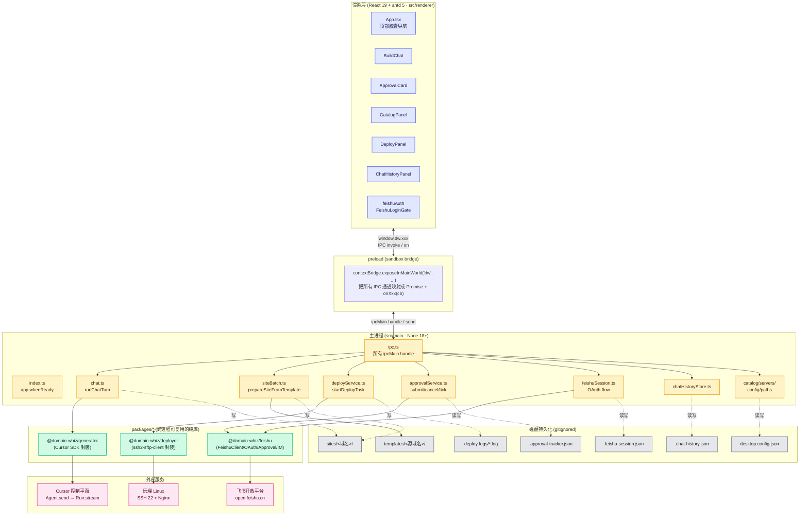

**关键约定**

- **渲染层不直接 import Node**：所有副作用（fs / net / ssh / spawn）都封在 `src/main/`，再通过 `preload` 暴露成 Promise API
- **业务逻辑放包里**：`packages/*` 三个包是纯 Node/TS 模块，没有任何 Electron 依赖——意味着 `scripts/deploy-batch.mjs` 这种 CLI 也能直接复用
- **持久化全部走仓库根的隐藏文件**：开发态 = 仓库根；打包后 = 与 .exe 同级（`paths.ts/getAppRoot`），便于人肉运维

---

## 2. Electron 三进程模型

**回答：为什么是 main / preload / renderer 三个进程？安全边界在哪？**

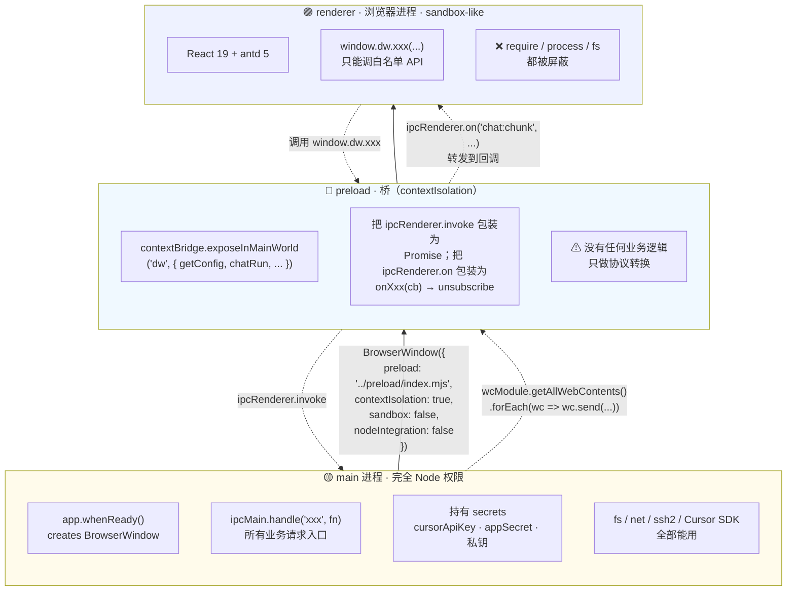

**`apps/desktop/src/main/index.ts` 真实启动顺序：**

```text
app.whenReady()
  → Menu.setApplicationMenu(null)
  → ensureUserConfigBootstrap()     // 拷贝示例配置（若不存在）
  → registerIpcHandlers()           // 注册全部 ipcMain.handle + 广播 listener
  → getApprovalService().start()    // 拉起 60s 审批轮询
  → createMainWindow()              // 主窗口（开发态自动开 DevTools）
```

退出时：

```text
app.on('before-quit')
  → flush + stop ApprovalService    // 把跟踪表落盘，停定时器
```

---

## 3. IPC 通道矩阵

**回答：渲染层能调什么？主进程能广播什么？**

`apps/desktop/src/main/ipc.ts` 是唯一入口。**所有 IPC 通道总览**：

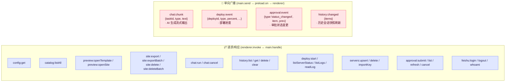

**广播实现细节** —— `ipc.ts/broadcast()` 一次性发给所有活动 `webContents`，避免多窗口时漏推：

```ts
for (const wc of wcModule.getAllWebContents()) {
  if (wc.isDestroyed()) continue;
  try { wc.send(channel, payload); } catch { /* ignore */ }
}
```

**为什么要广播 vs 请求？**

| 场景 | 模式 | 原因 |
| :--- | :--- | :--- |
| 流式日志（AI / 部署） | 广播 | 高频、产消异步，IPC invoke 单返回值搞不定 |
| 审批状态变更 | 广播 | 主进程 60s 主动 tick，渲染层是被动方 |
| 一次性查询 / 提交 | invoke | 一发一收，Promise 风格最自然 |

---

## 4. Cursor SDK：AI 全自动建站时序

**回答：单域名建站背后 `@cursor/sdk` 是怎么用的？**

```mermaid
flowchart TB
    classDef ui fill:#E0E7FF,stroke:#5B6CFF,color:#1E1B4B
    classDef main fill:#FEF3C7,stroke:#F59E0B,color:#451A03
    classDef pkg fill:#D1FAE5,stroke:#10B981,color:#022C22
    classDef ext fill:#FCE7F3,stroke:#EC4899,color:#500724
    classDef disk fill:#E5E7EB,stroke:#6B7280,color:#111827
    classDef ok fill:#10B981,stroke:#10B981,color:#fff
    classDef err fill:#DC2626,stroke:#DC2626,color:#fff

    subgraph S1["① IPC 入口（同步握手）"]
      direction TB
      A1[渲染层 BuildChat<br/>dw.chatRun mode:ai-full]:::ui
      A2[preload<br/>ipcRenderer.invoke 'chat:run']:::ui
      A3[main/ipc.ts<br/>running=true<br/>startNewTaskAbortController]:::main
      A4[chat.ts runChatTurn<br/>mkdir sites/&lt;域名&gt;/<br/>判断 isExisting · 写历史]:::main
      A1 --> A2 --> A3 --> A4
    end

    subgraph S2["② Agent 启动 + Run 创建"]
      direction TB
      B1[generator.runStaticSiteGenerate<br/>buildSystemPrompt + 整站约束]:::pkg
      B2[Agent.create<br/>apiKey · model:'composer-2'<br/>local.cwd = sites/&lt;域名&gt;/]:::pkg
      B3[Cursor Cloud<br/>bootstrap agent → agentId]:::ext
      B4[agent.send prompt<br/>history.attachIds agentId]:::pkg
      B5[Cursor Cloud<br/>post run → runId]:::ext
      B6[history.attachIds runId<br/>挂 signal.aborted → run.cancel]:::main
      B1 --> B2 --> B3 --> B4 --> B5 --> B6
    end

    subgraph S3["③ run.stream 实时回灌（循环）"]
      direction TB
      C1[Cursor Cloud<br/>yield assistant event]:::ext
      C2["generator<br/>取 content[].text<br/>调 onLog"]:::pkg
      C3[chat.ts<br/>history.appendChunk<br/>emit 'chat:chunk']:::main
      C4[broadcast 全部 webContents]:::main
      C5[BuildChat<br/>追加 ChatMessage 流式渲染]:::ui
      C1 --> C2 --> C3 --> C4 --> C5
      C5 -. 直至 Cursor 流结束 .-> C1
    end

    subgraph S4["④ 终态判定 + 落库 + 同步返回"]
      direction TB
      D1[run.wait → result.status]:::pkg
      D2[validateStaticSite outputDir<br/>检查 index.html + 相对 href/src]:::pkg
      D3{校验通过?}
      D4[history.finish 'done']:::main
      D5[history.finish 'error']:::main
      D6[ipc.ts running=false<br/>返回 ChatRunResult]:::main
      D7[BuildChat Promise resolve<br/>UI 收尾]:::ui
      Ok([✓ ok:true]):::ok
      Er([✗ ok:false<br/>error: 'index.html 引用缺失...']):::err
      D1 --> D2 --> D3
      D3 -->|是| D4 --> Ok --> D6 --> D7
      D3 -->|否| D5 --> Er --> D6
    end

    A4 --> B1
    B6 --> C1
    C5 --> D1

    subgraph DS["磁盘"]
      DSK[sites/&lt;域名&gt;/<br/>Agent 文件操作落地]:::disk
    end
    B2 -. cwd 绑定 .-> DSK
```

**Cursor SDK 关键调用点**

| 调用 | 作用 | 注意事项 |
| :--- | :--- | :--- |
| `Agent.create({local:{cwd}})` | 启动一个绑定到本地目录的 Agent | `cwd` = `sites/<域名>/`，Agent 的文件操作就发生在这里 |
| `agent.send(prompt)` | 提交一次会话，返回 `Run` | Prompt 由 `buildSystemPrompt + 整站约束 + 用户需求 + 模式提示` 拼成 |
| `run.stream()` | 异步迭代器，吐 `assistant` 事件 | 我们只摘 `content[].text` 喂给 onLog |
| `run.cancel()` | 远端中断 | 仅当 `run.supports('cancel')` 才挂 abort 监听 |
| `run.wait()` | 等终态 | `status === 'error'` 时主动失败 |
| `Symbol.asyncDispose` | 资源回收 | SDK 版本差异：拿不到就跳过 |

**安全清理**：错误 message 在返回前会 redact `cursor_xxx` 与 `sk-xxx`，避免 API Key 误进日志。

---

## 5. 模板批量复刻流水线

**回答：从「填几个域名」到「sites/ 多了几个新目录」中间发生了什么？**

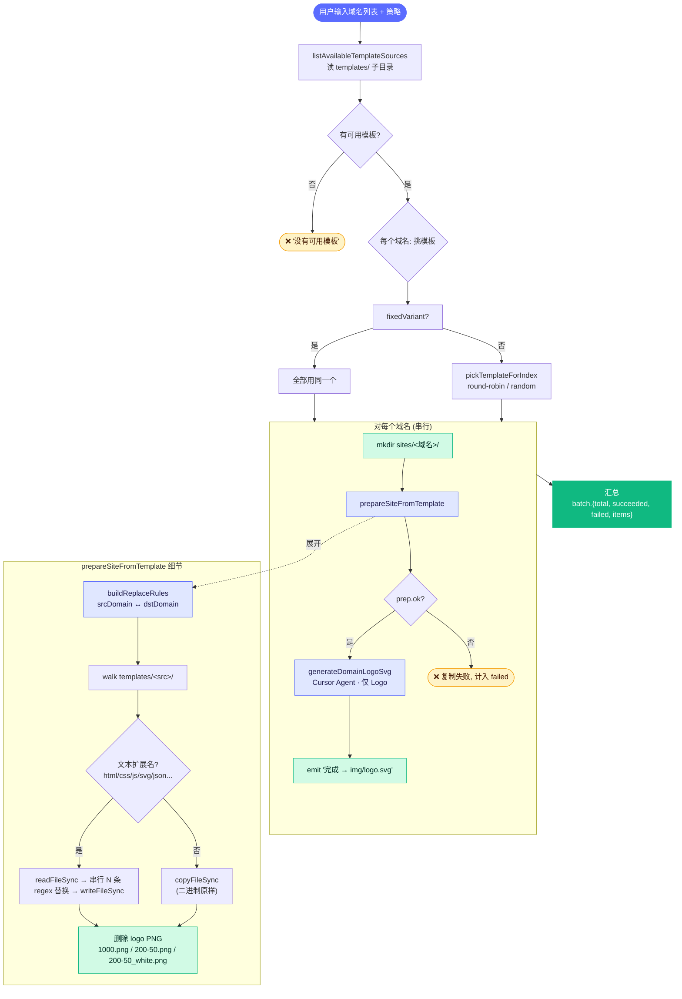

**关键策略**

- **替换规则顺序敏感**：完整域名（`adliftlab.com`）→ 大写品牌（`ADLIFTLAB`）→ Title Case（`Adliftlab`）→ 小写 slug（`adliftlab`）。倒过来会把 `adliftlab.com` 提前切碎成 `foo.com`。
- **文本扩展名白名单**：`.html / .htm / .css / .js / .mjs / .cjs / .json / .txt / .md / .svg / .xml`，其它二进制（PNG/WEBP/字体）原样 copy
- **logo 路径硬性收敛**：模板里所有 `img/1000.png` / `img/200-50.png` / `img/200-50_white.png` 引用都被改写为 `img/logo.svg`，然后这三个 PNG 从输出目录删掉，节省后续上传带宽（每张 ~10 MB）

---

## 6. 飞书 OAuth 登录时序

**回答：桌面应用怎么用 OAuth 拿到登录人的 user_id？**

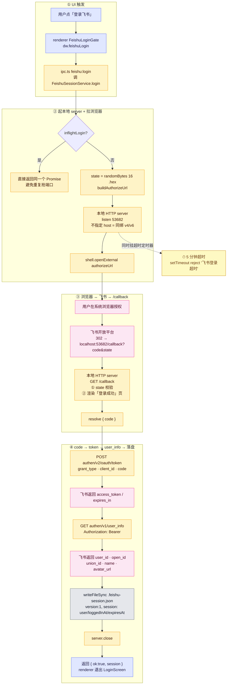

**为什么要起本地 HTTP server 接 callback？**

桌面应用没有公网 URL 可以让飞书回跳。常见做法：

1. ❌ 自定义协议（`domainwhiz://callback?code=...`）：需要 OS 注册，跨平台麻烦
2. ✅ **本地回环端口**：开发简单，飞书后台白名单填 `http://localhost:53682/callback` 即可

**安全保障**

- `state` 用 `randomBytes(16)` 生成，回调校验防 CSRF
- 不持久化 `refresh_token`（过期就重登）
- access_token 失效不主动清磁盘——下次登录直接覆盖

---

## 7. 飞书审批生命周期

**回答：从「点确认提交」到「审批通过收到通知」中间发生了什么？**

### 7.1 状态机

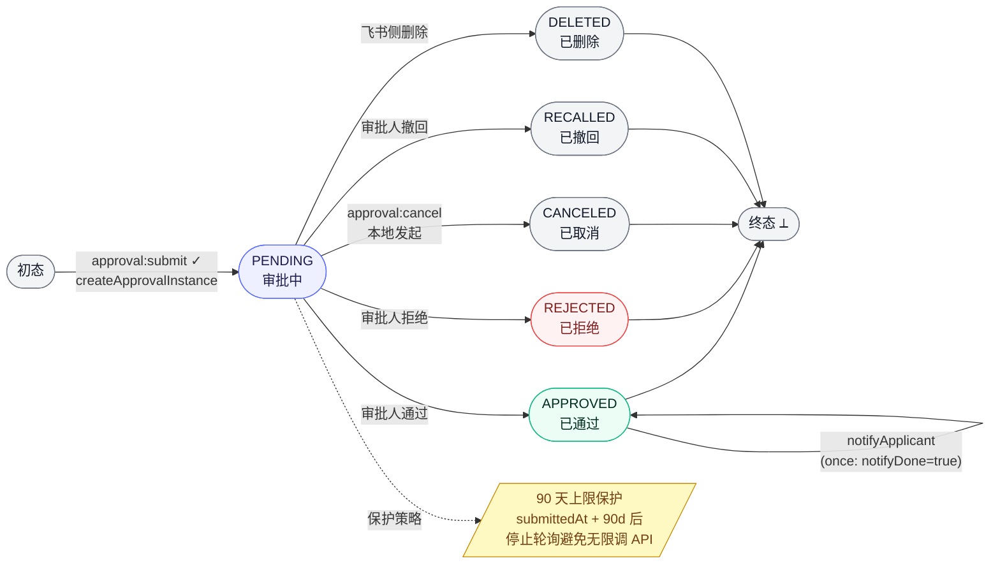

### 7.2 提交 + 轮询 + 通知 完整时序

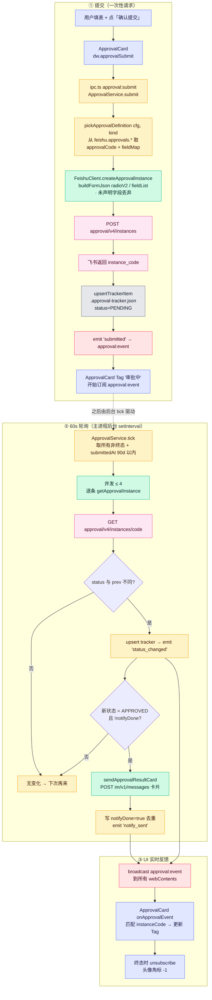

**关键设计点**

| 关注点 | 实现 |
| :--- | :--- |
| **服务进程级单例** | `getApprovalService()` 懒加载，`app.whenReady()` 后调 `.start()` 拉起 |
| **崩溃恢复** | start() 立刻 tick 一次，把上次进程崩前的 PENDING 全刷一遍 |
| **并发上限** | `POLL_CONCURRENCY = 4`，避免一次性把飞书 API 打爆 |
| **单条 tick 失败不阻断整体** | 每个 `pollOne` 都 try/catch，下次再来 |
| **APPROVED 通知去重** | `notifyDone=true` 写回跟踪表；后续 tick 不再重发 |
| **配置热切换** | `submit()` / `tick()` 前都 `reloadConfig()`，用 fingerprint 判定是否需要重建 client |
| **退出阶段保护** | `before-quit` flush 一次跟踪表，避免脏写 |

---

## 8. SSH + Nginx 部署时序

**回答：「一键部署」按下去到底做了什么？**

### 8.1 主流程

```mermaid
flowchart TB
    classDef ui fill:#E0E7FF,stroke:#5B6CFF,color:#1E1B4B
    classDef main fill:#FEF3C7,stroke:#F59E0B,color:#451A03
    classDef pkg fill:#D1FAE5,stroke:#10B981,color:#022C22
    classDef ext fill:#FCE7F3,stroke:#EC4899,color:#500724
    classDef disk fill:#E5E7EB,stroke:#6B7280,color:#111827
    classDef cast fill:#FFE4E6,stroke:#F43F5E,color:#4C0519
    classDef stage1 fill:#F1F5F9,stroke:#64748B,color:#0F172A
    classDef stage2 fill:#FEF3C7,stroke:#D97706,color:#451A03
    classDef stage3 fill:#DCFCE7,stroke:#16A34A,color:#052E16

    subgraph S0["① IPC 入口 + 同步握手"]
      direction TB
      A1[CatalogPanel / DeployPanel<br/>dw.deployStart domain · host]:::ui
      A2[ipc.ts deploy:start<br/>startDeployTask cfg, input]:::main
      A3[deployService<br/>· 校验 domain & host & sites/&lt;域名&gt;<br/>· resolveDeployServer 用户名+私钥<br/>· deployId = randomUUID<br/>· listFilesRecursive 算 totalFiles/Bytes]:::main
      A4[.deploy-logs/&lt;d&gt;__&lt;h&gt;__&lt;ts&gt;.log<br/>appendFile 'start ...']:::disk
      A5["同步返回 { ok:true, deployId }<br/>UI 拿到 deployId 启进度条"]:::ui
      A1 --> A2 --> A3 --> A4 --> A5
    end

    subgraph S1["② 异步任务启动（Promise.resolve.then）"]
      direction TB
      B1[emit deploy:event<br/>type=start, totalBytes, totalFiles]:::cast
      B2[deployer.deploySiteWithNginx<br/>· 检查私钥 PEM / 文件路径<br/>· useSudo = username !== 'root']:::pkg
      B3[Sftp client.connect<br/>host/port/username/privateKey/passphrase]:::pkg
      B1 --> B2 --> B3
    end

    subgraph S2["阶段 1 · 上传到 /tmp 暂存 🚚"]
      direction TB
      C1[Sftp mkdir /tmp/dwz-&lt;domain&gt;-&lt;tag&gt;/]:::stage1
      C2[逐文件 mkdir 父目录 idempotent]:::stage1
      C3[Sftp fastPut local → remote]:::stage1
      C4[emit type=upload, filename, percent]:::cast
      C5[Sftp put Buffer nginxConfig<br/>→ /tmp/dwz-&lt;domain&gt;-&lt;tag&gt;.conf]:::stage1
      C1 --> C2 --> C3 --> C4
      C4 -. 直至所有文件 .-> C2
      C4 --> C5
    end

    subgraph S3["阶段 2 · 原子切换 + 改属主 ⚛（按需 sudo）"]
      direction TB
      D1[sudo mkdir -p /var/www /etc/nginx/sites-enabled]:::stage2
      D2[sudo rm -rf /var/www/&lt;domain&gt;]:::stage2
      D3[sudo mv /tmp/&lt;domain&gt;/ → /var/www/&lt;domain&gt;]:::stage2
      D4[sudo chown -R root:root /var/www/&lt;domain&gt;]:::stage2
      D5[sudo mv /tmp/....conf → /etc/nginx/sites-enabled/&lt;domain&gt;]:::stage2
      D6[sudo chown root:root sites-enabled/&lt;domain&gt;]:::stage2
      D1 --> D2 --> D3 --> D4 --> D5 --> D6
    end

    subgraph S4["阶段 3 · reload nginx 🔄"]
      direction TB
      E1[sudo nginx -t]:::stage3
      E2{syntax ok?}
      E3[sudo nginx -s reload]:::stage3
      E4([❌ 抛错 → 进入失败重试链路]):::cast
      E1 --> E2
      E2 -->|是| E3
      E2 -->|否| E4
    end

    subgraph S5["④ 收尾与广播"]
      direction TB
      F1["deployer 返回 { ok:true, bytesUploaded, ms }"]:::pkg
      F2[emit type=done, percent:100, bytes, ms]:::cast
      F3[.deploy-logs/*.log appendFile 'done ...']:::disk
      F4[UI onDeployEvent<br/>进度条 100% · 日志抽屉滚到底]:::ui
      F1 --> F2 --> F3 --> F4
    end

    A5 --> B1
    B3 --> C1
    C5 --> D1
    D6 --> E1
    E3 --> F1
```

### 8.2 失败重试与错误归一化

```mermaid
flowchart LR
    A[deploySiteWithNginx] --> B{attempt 1<br/>deploySiteOnce}
    B -->|throw| C[onProgress connect '部署失败，1.5s 后重试一次']
    C --> D[sleep 1500ms]
    D --> E{attempt 2<br/>deploySiteOnce}
    E -->|ok| F([✓ DeploySiteResult]):::ok
    E -->|throw| G[classifySshError]:::warn
    G --> G1[ENOENT → '私钥路径不存在或不可读']
    G --> G2[passphrase|encrypted → '需要口令']
    G --> G3[handshake|host key → '主机密钥校验失败']
    G --> G4[Authentication → '用户名/私钥/口令不正确']
    G --> G5[Permission denied → '权限被拒绝']
    G --> G6[兜底：原始 message + redact BEGIN..END PEM]
    G --> H(["✗ {ok:false, error}"]):::err
    B -->|ok| F

    classDef ok fill:#10B981,color:#fff
    classDef warn fill:#F59E0B,color:#451A03
    classDef err fill:#DC2626,color:#fff
```

**关键设计点**

| 关注点 | 实现 |
| :--- | :--- |
| **/tmp 中转 + sudo 原子切换** | 普通用户没有 `/var/www` 写权限，先 SFTP 到 `/tmp`，再 `sudo mv` 一刀切换。`mv` 是原子的，请求中途不会出现「半个站点」 |
| **deleteRemoteExtras 已禁用** | 设计上「整目录替换」语义，`rm -rf` 老目录 + `mv` 新目录最简单清晰，无需扫描差异 |
| **nginx 配置由模板渲染** | `renderNginxConfig` 内联在 `deployer/src/index.ts`，包含 `listen 80 / [::]:80`、`server_name <domain> www.<domain>`、`root <webRoot>/<domain>`、`try_files` |
| **进度推送解耦** | `DeployProgress` 是 `deployer` 包的协议，`deployService` 把它翻译成 `DeployEvent`（加 `deployId / percent / fileIndex` 等 UI 友好字段） |
| **日志双写** | 进度同时写入文件（`.deploy-logs/*.log`）+ 广播（`deploy:event`）。文件保证可复盘，广播保证 UI 实时 |
| **shell 注入防御** | 所有路径过 `quoteShell()` → `'foo'` 风格强引号 + 转义单引号；不允许变量插值进 shell |

---

## 9. 网站库批量删除：三道安全闸 + 模板隔离

**回答：UI 上单卡 trash / 顶部「批量删除」按下去到底删的是什么？为什么模板永远删不掉？**

### 9.1 总览

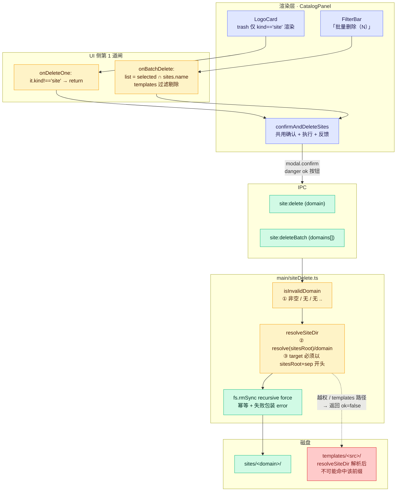

### 9.2 三道安全闸（main/siteDelete.ts）

| # | 闸门 | 拒绝什么 | 兜底返回 |
| :-: | :--- | :--- | :--- |
| ① | `isInvalidDomain(d)` | 空串 / 含 `/` `\` / 含 `..` | `{ok:false, error:'域名无效'}` |
| ② | `path.resolve(sitesRoot, d) + 前缀比对` | 通过 symlink / 绝对路径 / 多重 `..` 跳出 `sites/` | 返回 `null`，外层翻译成 `ok:false` |
| ③ | `existsSync + isDirectory` | 路径不存在（已删）或文件而非目录 | 不存在 → 幂等 `ok:true`；非目录 → `ok:false` |

**为什么 templates/ 不可能被命中：** UI 层第 1 道闸已把 `kind === 'template'` 全部过滤掉；即使有人手动拼参数绕过 UI，`resolveSiteDir` 用 `sitesRoot` 做前缀守卫，目标只能落在 `sites/` 子目录里——而 `templates/` 是 `sitesRoot` 的兄弟目录，绝无前缀重合。

### 9.3 UI 侧确认与反馈

```mermaid
flowchart TB
    classDef ui fill:#E0E7FF,stroke:#5B6CFF,color:#1E1B4B
    classDef main fill:#FEF3C7,stroke:#F59E0B,color:#451A03
    classDef gate fill:#FEF3C7,stroke:#F59E0B,color:#451A03
    classDef ok fill:#D1FAE5,stroke:#10B981,color:#022C22
    classDef warn fill:#FFE4E6,stroke:#F43F5E,color:#4C0519

    subgraph U1["① 触发"]
      direction TB
      A1[用户点单卡 🗑 或<br/>顶部「批量删除（N）」]:::ui
      A2[算 list:<br/>· 单条 → list=&#91;it.name&#93;<br/>· 批量 → selected ∩ sites.name]:::ui
      A3{list 为空?}
      Aw[message.warning<br/>'请先勾选要删除的站点<br/>（templates 无法删除）']:::warn
      A1 --> A2 --> A3
      A3 -->|是 全选模板| Aw
    end

    subgraph U2["② 二次确认（antd modal.confirm）"]
      direction TB
      B1[弹 modal.confirm<br/>title=删除 N 个网站？<br/>content=域名预览 + 模板不会被删<br/>okButtonProps.danger=true]:::ui
      B2{用户选择}
      B3([取消 → 不做任何事]):::ui
      B4[点「删除（N）」→ onOk]:::ui
      B1 --> B2
      B2 -->|取消| B3
      B2 -->|确认| B4
    end

    subgraph U3["③ 主进程执行（三道安全闸）"]
      direction TB
      C1[window.dw.siteDeleteBatch list]:::ui
      C2[ipc.ts site:deleteBatch<br/>deleteSitesBatch list]:::main
      C3[去重 → 串行遍历 domains]:::main
      C4[isInvalidDomain ⊘ ../ 空 / 含 /]:::gate
      C5[resolveSiteDir<br/>path.resolve sitesRoot/domain<br/>前缀必须 = sitesRoot+sep]:::gate
      C6{校验通过?}
      C7[fs.rmSync recursive,force<br/>幂等：不存在也 ok:true]:::main
      C8["items.push { domain, ok:false, error }"]:::warn
      C9["items.push { domain, ok:true }"]:::ok
      C1 --> C2 --> C3 --> C4 --> C5 --> C6
      C6 -->|否| C8
      C6 -->|是| C7 --> C9
      C8 -. 不中断后续 .-> C3
      C9 -. 不中断后续 .-> C3
    end

    subgraph U4["④ 反馈 + 选中态精细化清理 + 刷新"]
      direction TB
      D1["返回 { ok, items }"]:::main
      D2{失败条数}
      D3[message.success<br/>'已删除 N 个网站']:::ok
      D4[message.warning<br/>'完成 M 个 失败 K 个：firstErr']:::warn
      D5[setSelected prev → prev - list<br/>仅剔除本批 保留其它勾选]:::ui
      D6[refresh → catalog:listAll<br/>重新拉网站库]:::ui
      D1 --> D2
      D2 -->|=0| D3
      D2 -->|>0| D4
      D3 --> D5 --> D6
      D4 --> D5
    end

    A3 -->|否| B1
    B4 --> C1
    C3 -. 全部 domain 处理完 .-> D1
```

**关键设计点**

| 关注点 | 实现 |
| :--- | :--- |
| **单卡 trash 与批量删除复用一份逻辑** | `confirmAndDeleteSites(list)` 统一弹 modal、调 IPC、做反馈、按需 refresh |
| **模板从 UI 层就不暴露入口** | `LogoCard` 的 `onDelete` 只在 `kind === 'site'` 时被父组件传入，模板卡片连按钮都不渲染 |
| **批量按钮文案带可删数量** | `「批量删除（N）」` 的 N 来自 `selected ∩ sites`，混选了模板时实时显示真实可删数 |
| **删除是幂等的** | 目录不存在直接 `ok:true`；UI 拿到的列表可能已过期，重试也不会报错 |
| **失败不阻断其它项** | `deleteSitesBatch` 串行执行，每个 domain 独立 `try/catch`，失败只影响该项 |
| **选中态精细化清理** | 仅 `setSelected(prev → prev - list)`，**不**清掉用户其它的勾选 |

---

## 附录 A：包依赖与版本

```text
domain-whiz (workspaces: apps/*, packages/*)
│
├─ apps/desktop  ────────────────────  electron / electron-vite / electron-builder
│                                       react 19 / antd 5 / zustand
│                                       @cursor/sdk (via packages/generator)
│
├─ packages/generator  ──────────────  @cursor/sdk · 无 Electron 依赖
├─ packages/deployer   ──────────────  ssh2-sftp-client · 无 Electron 依赖
└─ packages/feishu     ──────────────  无第三方运行时（裸 fetch）· 无 Electron 依赖
```

**为什么 `packages/*` 不依赖 Electron？**

- 这三个包是「**业务原语**」，未来要被 CLI / 后端 / 测试 / serverless 复用
- 已有 `scripts/deploy-batch.mjs` 直接 import `@domain-whiz/deployer`，跑命令行批量部署

---

## 附录 B：安全边界一览

| 资产 | 存放位置 | 谁能读？ | 防护手段 |
| :--- | :--- | :--- | :--- |
| `cursorApiKey` | `desktop.config.json` | 主进程 only | 不出现在错误 message（redact `cursor_xxx`）；不进 IPC 返回的 PublicConfig（`toPublicConfig` 深拷贝即可，本字段未被脱敏，**仍需注意**） |
| 飞书 `appSecret` | `desktop.config.json` | 主进程 only | `FeishuClient` 不打印；不进错误 message |
| `user_access_token` | `.feishu-session.json` | 主进程 only | 不持久化 `refresh_token`；过期重登 |
| SSH 私钥（PEM 文本） | `desktop.config.json` | 主进程 only | 错误 message 中 `BEGIN..END PEM` 被替换为 `[REDACTED_KEY]` |
| SSH 私钥（文件路径） | 用户文件系统 | 主进程 only | 路径不进错误 message；passphrase 字段同样 |
| 审批跟踪表 | `.approval-tracker.json` | 主进程 only | 不含 token，仅 `instance_code / user_id / form 字段值` |

---

## 附录 C：扩展点（哪里加新功能最容易）

| 想加什么 | 建议入口 |
| :--- | :--- |
| 新的 AI 建站约束 | `packages/generator/src/constraints.ts` 加常量，`chat.ts` 改 `siteStyleConstraints` 入参 |
| 新的飞书 widget 类型 | `packages/feishu/src/approval.ts/normalizeWidgetValue` 加分支 |
| 新的部署目标（K8s / S3 / OSS） | `packages/deployer/src/` 新文件，仿照 `deploySiteWithNginx` 写一个；`deployService.ts` 加分支 |
| 新的 IPC 通道 | `ipc.ts` 加 `ipcMain.handle`；`preload/index.ts` 加桥；`renderer/global.d.ts` 加类型 |
| 新的桌面 Tab | `App.tsx/TopNavPills` 加一项 + 路由分支 |
| 给网站库加新的危险动作（清空缓存 / 重命名 / 复制等） | 仿 `main/siteDelete.ts` 写新文件 → 走 `resolveSiteDir` 同款三道闸 → `CatalogPanel/confirmAndDeleteSites` 复用确认 + 反馈范式 |

---

<div align="center">

📖 想知道日常用法？请看 [`USAGE.md`](./USAGE.md)
🛠 项目根 README：[`../README.md`](../README.md)

</div>
